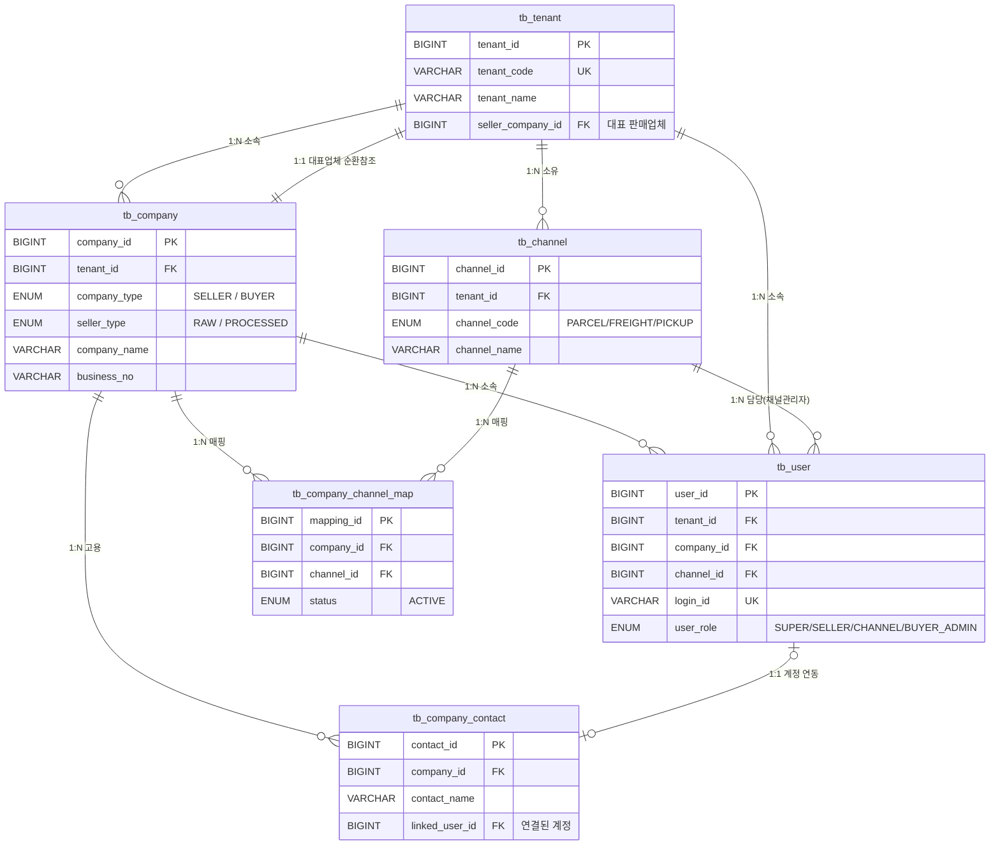

# 데이터베이스 관계도 (ERD)

다음은 현재 시스템의 핵심 엔티티(`tb_tenant`, `tb_company`, `tb_channel`, `tb_user`, `tb_company_channel_map` 등) 간의 논리적 관계를 나타내는 ERD입니다.

### 💡 핵심 설계 포인트 (아키텍처 관점)
1. **의존성 역전 및 분리 (Decoupling)**
   - `tb_channel`은 개별 판매업체가 아닌 플랫폼(`tb_tenant`)에 종속됩니다. 이를 통해 동일한 채널(예: 전국택배)을 여러 판매업체나 구매업체가 공유할 수 있습니다.
2. **역할 기반 접근 및 소속 유연성**
   - `tb_user` 테이블 하나로 모든 계정을 통합 관리하며, `company_id`와 `channel_id` 컬럼의 조합에 따라 권한(Role) 스코프가 결정됩니다. (예: `channel_id`가 할당된 유저는 해당 채널 데이터만 조회 가능)
3. **N:M 다대다 매핑**
   - 업체(`tb_company`)와 채널(`tb_channel`)의 직접 연결을 피하고 `tb_company_channel_map` (혹은 `tb_buyer_channel`)을 중간에 두어, 하나의 업체가 다수의 물류 채널에 동시 참여할 수 있도록 정규화되었습니다.
